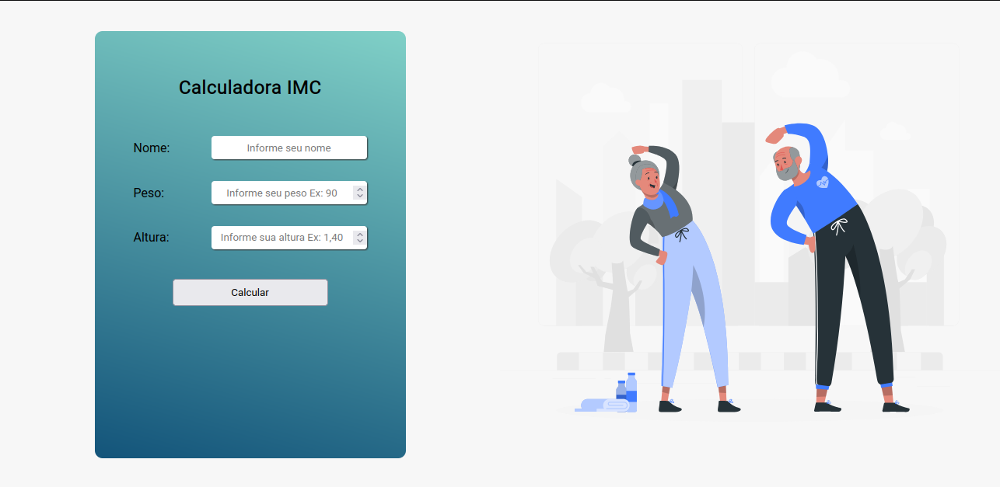
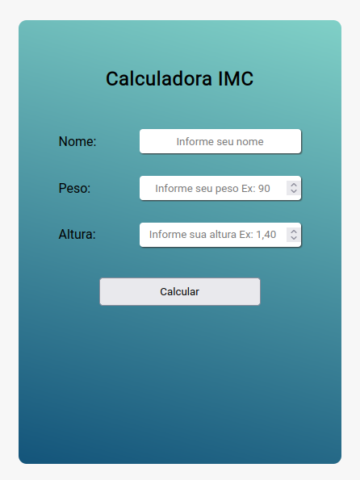

<h1 align="center"> Projeto calculadora imc </h1>

  <a href="#-tecnologias">Tecnologias</a>&nbsp;&nbsp;&nbsp;|&nbsp;&nbsp;&nbsp;
  <a href="#-projeto">Projeto</a>&nbsp;&nbsp;&nbsp;|&nbsp;&nbsp;&nbsp;
  <a href="#-layout">Layout</a>&nbsp;&nbsp;&nbsp;|&nbsp;&nbsp;&nbsp;
  <a href="#memo-licença">Licença</a>

  

 

 <h2>Desktop</h2>
  
  
  <h2>Mobile</h2>
  

## 🚀 Tecnologias

Esse projeto foi desenvolvido com as seguintes tecnologias:

- HTML e CSS
- JavaScript
- Git e Github

## 💻 Projeto

O projeto calculadora imc tem como objetivo avaliar se uma pessoa está dentro do peso que é considerado ideal para a sua altura..

## :memo: Licença

Esse projeto está sob a licença MIT.

---
